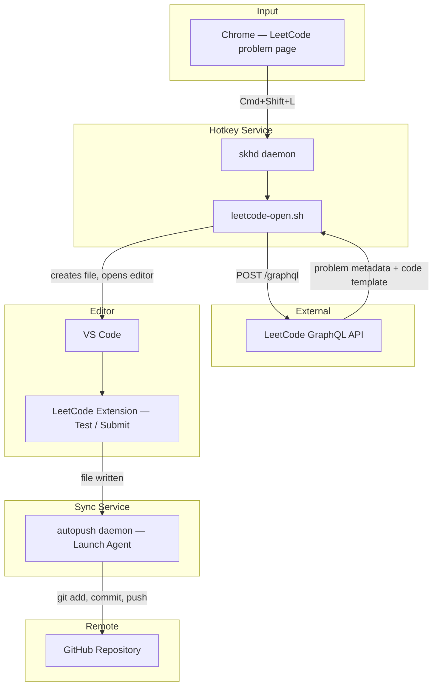

# leet-sync

An automated LeetCode workflow for macOS that handles the repetitive parts of competitive programming practice — fetching problems, organizing files, and syncing solutions to GitHub — so I can focus on solving.

## Overview

One hotkey (`Cmd+Shift+L`) from any LeetCode problem page in Chrome:
1. Fetches the problem metadata and C++ template from LeetCode's GraphQL API
2. Creates the solution file at the correct path with proper extension markers
3. Opens it in VS Code, ready to code

After submission, a background daemon commits and pushes the solution here automatically.

## Architecture



## Repository Structure

```
leet-sync/
├── scripts/
│   ├── setup.sh               — one-command install and configuration
│   ├── leetcode-open.sh       — Chrome → LeetCode API → VS Code bridge
│   └── autopush.sh            — background daemon: poll, commit, push
│
├── config/
│   ├── vscode/settings.json   — editor settings (no autocomplete, no diagnostics)
│   ├── launchd/               — macOS Launch Agent plist for autopush
│   └── skhdrc                 — global hotkey binding
│
├── solutions/                  — {topic}/{difficulty}/{id}.{name}.cpp
│   ├── array/
│   │   ├── easy/
│   │   └── medium/
│   ├── linked-list/
│   │   └── medium/
│   └── math/
│       └── easy/
│
├── .gitignore
├── LICENSE
└── README.md
```

## Solution File Format

Each file includes the markers required by the VS Code LeetCode extension for in-editor test and submit:

```cpp
/*
 * @lc app=leetcode id=61 lang=cpp
 *
 * [61] Rotate List
 */

// @lc code=start
class Solution {
public:
    ListNode* rotateRight(ListNode* head, int k) {

    }
};
// @lc code=end
```

## Requirements

- macOS 13 or later
- [Homebrew](https://brew.sh)
- [Visual Studio Code](https://code.visualstudio.com)
- [Google Chrome](https://www.google.com/chrome/)
- [GitHub CLI](https://cli.github.com) (`brew install gh`)
- [skhd](https://github.com/koekeishiya/skhd) (`brew install koekeishiya/formulae/skhd`)
- [JetBrains Mono](https://www.jetbrains.com/lp/mono/) (`brew install --cask font-jetbrains-mono`)
- Python 3 (ships with macOS)

## Installation

```bash
git clone https://github.com/ApurvPurohit/leet-sync.git /Volumes/workplace/LeetCode
cd /Volumes/workplace/LeetCode
./scripts/setup.sh
```

The setup script handles dependency installation, service registration, and editor configuration.

After running setup:

1. **Grant skhd accessibility access** — System Settings → Privacy & Security → Accessibility → add `/opt/homebrew/bin/skhd`
2. **Sign into the LeetCode extension** — VS Code → LeetCode sidebar → Cookie login
3. **Authenticate GitHub** — `gh auth login`

## Usage

1. Open any problem on `leetcode.com` in Chrome
2. Press `Cmd+Shift+L`
3. Write your solution in VS Code
4. Click Test → Click Submit
5. Solution is committed and pushed automatically

Re-opening a previously solved problem navigates to the existing file — edit and resubmit to overwrite.

## Services

Two macOS Launch Agents run in the background. Both start on login and restart if they crash.

| Service | Purpose |
|---------|---------|
| `com.koekeishiya.skhd` | Listens for the global hotkey |
| `com.leetcode.autopush` | Watches for file changes, waits for stability (30s), commits and pushes |

```bash
# status
launchctl list | grep -E "leetcode|skhd"

# restart autopush
launchctl unload ~/Library/LaunchAgents/com.leetcode.autopush.plist
launchctl load ~/Library/LaunchAgents/com.leetcode.autopush.plist

# restart skhd
skhd --restart-service

# logs
tail -f /tmp/leetcode-autopush.log
```

## Configuration

**Hotkey** — edit `config/skhdrc`, then `skhd --restart-service`

**Language** — update `leetcode.defaultLanguage` in `config/vscode/settings.json` and the language filter in `scripts/leetcode-open.sh`

**Repository path** — update the `REPO` variable in both scripts, the plist, the skhdrc, and the VS Code settings

## Editor Configuration

The workspace is configured for distraction-free problem solving:

- All autocomplete, suggestions, and inline hints disabled
- C/C++ IntelliSense and error diagnostics turned off (LeetCode templates are incomplete by design — includes are missing, so diagnostics are noise)
- JetBrains Mono 15px, light theme, no minimap, no status bar

## Commit Format

```
solve: 61.rotate_list
solve: 1.two_sum, 9.palindrome_number
```

## License

MIT
