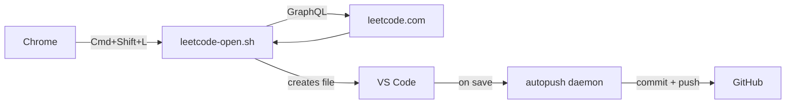

# leet-sync

My LeetCode setup. One hotkey to go from a problem page in Chrome to a ready-to-code file in VS Code, with solutions auto-pushed to this repo.

## How it works



I press `Cmd+Shift+L` while on a LeetCode problem in Chrome. A shell script grabs the URL, hits LeetCode's GraphQL API for the problem metadata and C++ starter code, drops it into the right folder, and opens it in VS Code. When I'm done solving, a background daemon picks up the change and pushes it here.

Both the hotkey listener (`skhd`) and the push daemon run as macOS Launch Agents — they start on login and stay running. I don't think about them.

## What's in here

```
scripts/
  setup.sh            — installs deps, wires up services
  leetcode-open.sh    — the hotkey script (Chrome → API → VS Code)
  autopush.sh         — polls for changes, commits, pushes

config/
  vscode/settings.json   — distraction-free editor (no autocomplete, no squiggles)
  launchd/               — plist for the autopush daemon
  skhdrc                 — hotkey binding

solutions/              — organized as {topic}/{difficulty}/{id}.{name}.cpp
```

## Setup

Requires macOS, Homebrew, VS Code, Chrome.

```bash
git clone https://github.com/ApurvPurohit/leet-sync.git
cd leet-sync
./scripts/setup.sh
```

The setup script installs `skhd`, `gh`, the LeetCode VS Code extension, and JetBrains Mono. It registers the Launch Agent and configures the hotkey.

After setup:
- Grant `skhd` accessibility access (System Settings → Privacy & Security → Accessibility)
- Sign into the LeetCode extension in VS Code (use Cookie method)
- `gh auth login` if not already authenticated

## Daily use

1. Open a problem on leetcode.com
2. `Cmd+Shift+L`
3. Write solution, hit Test, hit Submit
4. That's it — auto-pushed

If I open a problem I've already solved, it just opens the existing file.

## Editor config

VS Code is set up for distraction-free solving:
- No autocomplete, no parameter hints, no Copilot
- No IntelliSense squiggles (LeetCode templates don't include headers, so everything would be red)
- JetBrains Mono, light theme, no minimap, no status bar

## File naming

```
solutions/array/easy/1.two_sum.cpp
solutions/linked-list/medium/61.rotate_list.cpp
solutions/dynamic-programming/hard/312.burst_balloons.cpp
```

The topic comes from LeetCode's first tag for the problem. Difficulty is lowercase. Filename is `{id}.{snake_case_name}.cpp`.

## Commits

The autopush daemon waits for files to stop changing (30s of stability), then commits:

```
solve: 61.rotate_list
```

## Changing things

**Hotkey** — edit `config/skhdrc`, run `skhd --restart-service`

**Language** — change `leetcode.defaultLanguage` in `config/vscode/settings.json` and the `lang == 'C++'` filter in `scripts/leetcode-open.sh`

**Repo path** — grep for `/Volumes/workplace/LeetCode` and update everywhere (there are 5 places; yes, that's annoying, but it beats a config file for a personal tool)

## License

MIT
